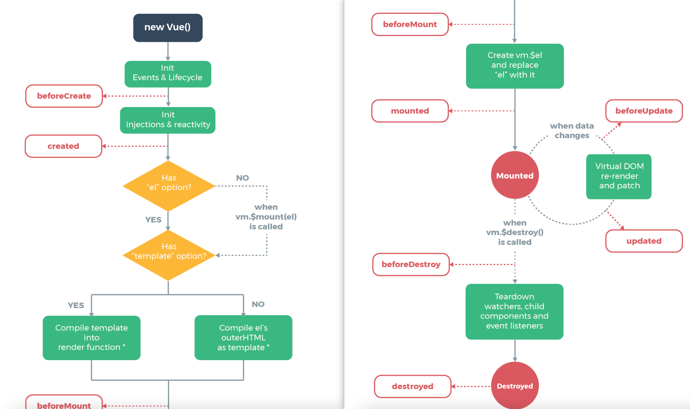

#### 生命周期钩子函数执行原理分析

> 每个 Vue 实例在被创建时都要经过一系列的初始化过程——例如，需要设置数据监听、编译模板、将实例挂载到 DOM 并在数据变化时更新 DOM 等。同时在这个过程中也会运行一些叫做**生命周期钩子**的函数，这给了用户在不同阶段添加自己的代码的机会。
>
> 比如 [`created`](https://cn.vuejs.org/v2/api/#created) 钩子可以用来在一个实例被创建之后执行代码：
>
> ```js
> new Vue({
>   data: {
>     a: 1
>   },
>   created: function () {
>     // `this` 指向 vm 实例
>     console.log('a is: ' + this.a)
>   }
> })
> // => "a is: 1"
> ```
>
> 也有一些其它的钩子，在实例生命周期的不同阶段被调用，如 [`mounted`](https://cn.vuejs.org/v2/api/#mounted)、[`updated`](https://cn.vuejs.org/v2/api/#updated) 和 [`destroyed`](https://cn.vuejs.org/v2/api/#destroyed)。生命周期钩子的 `this` 上下文指向调用它的 Vue 实例。

##### 一、生命周期示意图

