# VUE 2.0

### 一、基础用法

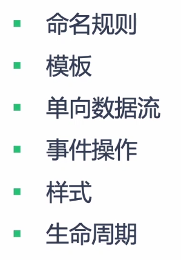

#### 1.vue cli

1.1 安装vue脚手架

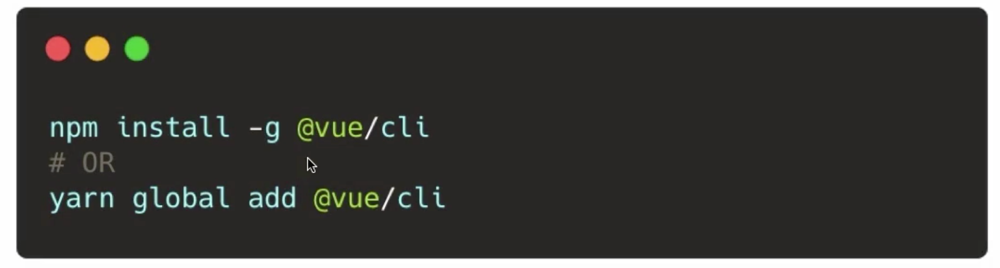

1.2 查看vue脚手架版本

vue -V

1.3查看vue版本

npm list vue

#### 2.单文件组件

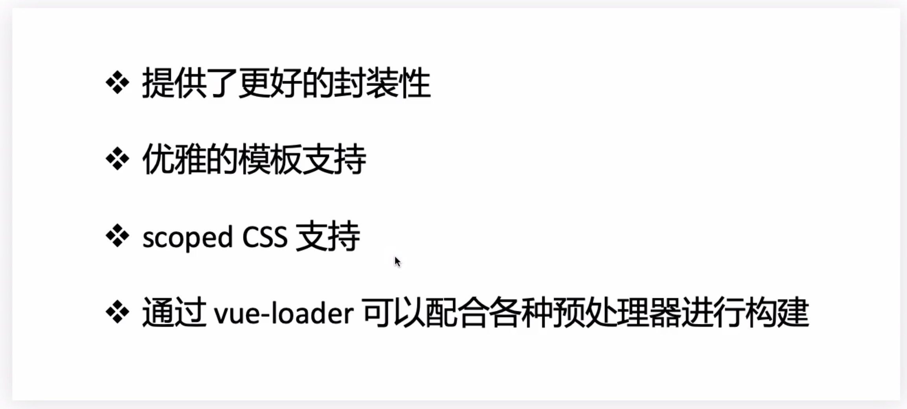

#### 3.命名规则

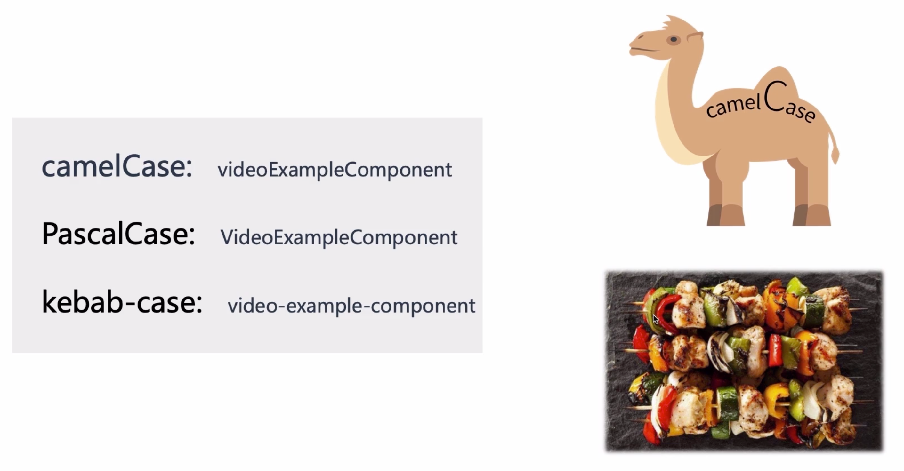

------

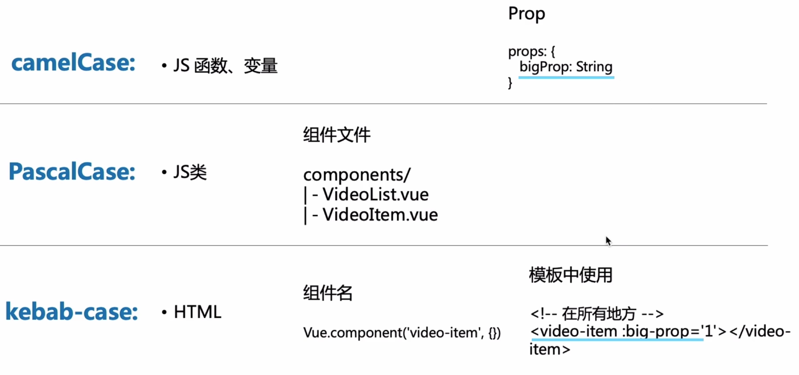

3.1 产生实例的都用大驼峰命名(PascalCase)，因为我们的js类和组件都可以产生多个实例

3.2 kebab-case 烤肉串命名方式，在HTML当中是大小写不敏感的，正是因为这样，我们在模板当中约定采用烤肉串的方式命名

3.3 有人会问组件名称为大驼峰，变量名为小驼峰，怎么在模版当中可以通过烤肉串的方式使用呢，那是因为在vue当中会存在值的映射，将大小驼峰映射成烤肉串形式，我们在模板当中写的标签最终会被编译成PascalCase的js类

#### 4.模板

##### 4.1模板语法

> vue.js 使用了基于html的模板语法，所有vue.js的模板都是合法的html，所以能被遵循规范的浏览器和html解析器解析

##### 4.2 模板插值

> 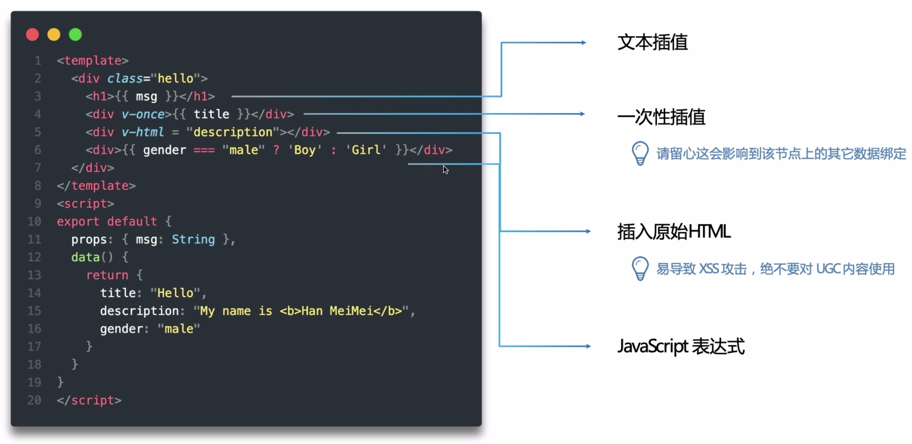

##### 4.3 指令

> 指令是带有v-前缀的特殊特性，当表达式的值发生改变时将其产生的原带影响,响应式的作用到该dom节点上
>
> v-on 事件绑定，可简写成冒号:
>
> v-bind 属性绑定，可简写成艾特符号@

##### 4.4 条件渲染

> v-if会根据响应式的参数，在切换过程中条件块的事件监听和子组件会被虚拟dom销毁和重建
>
> 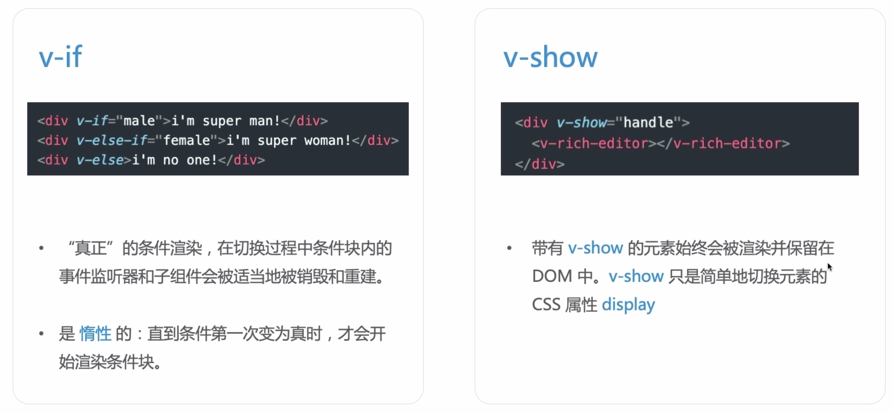

##### 4.5  列表循环

> 不推荐在同一元素上使用v-if和v-for
>
> 非得用的话，记住v-for的优先级高于v-if
>
> 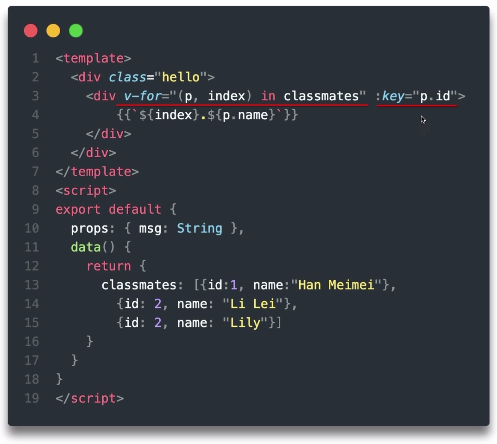

##### 4.6 ref

> ref访问子组件或者dom节点（获取dom节点的this）
>
> 通过ref可以拿到子组件或者dom节点的方法和属性
>
> ⚠️：只有在组件或者dom节点被渲染出来以后，才能通过this.$refs去访问
>
> 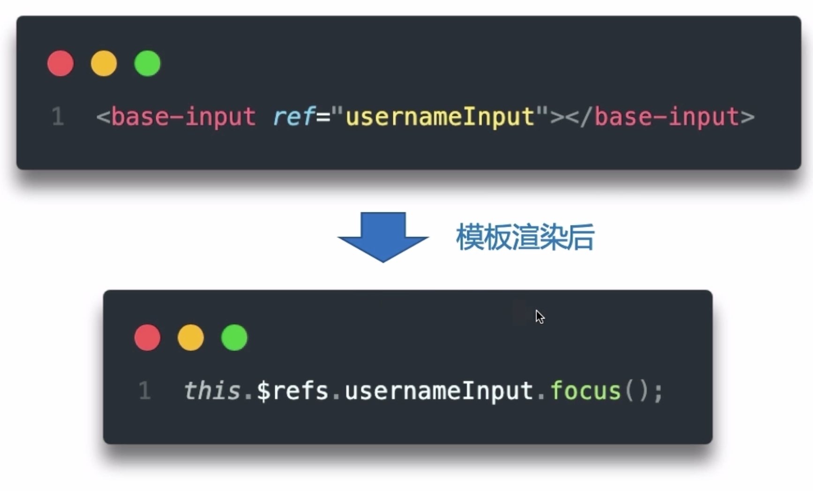

##### 4.7 JSX

> 首先我们得抛弃我们template，然后声明rander()函数
>
> JSX-条件渲染
>
> 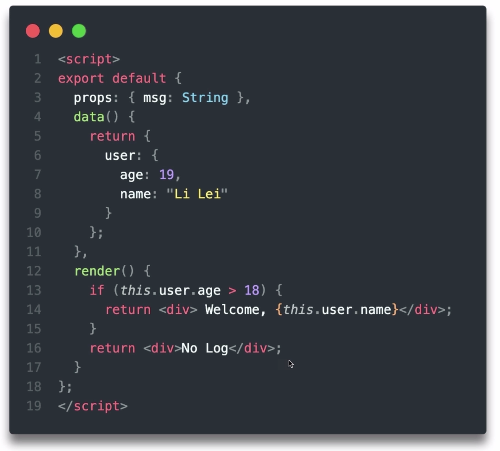
>
> JSX-列表循环
>
> 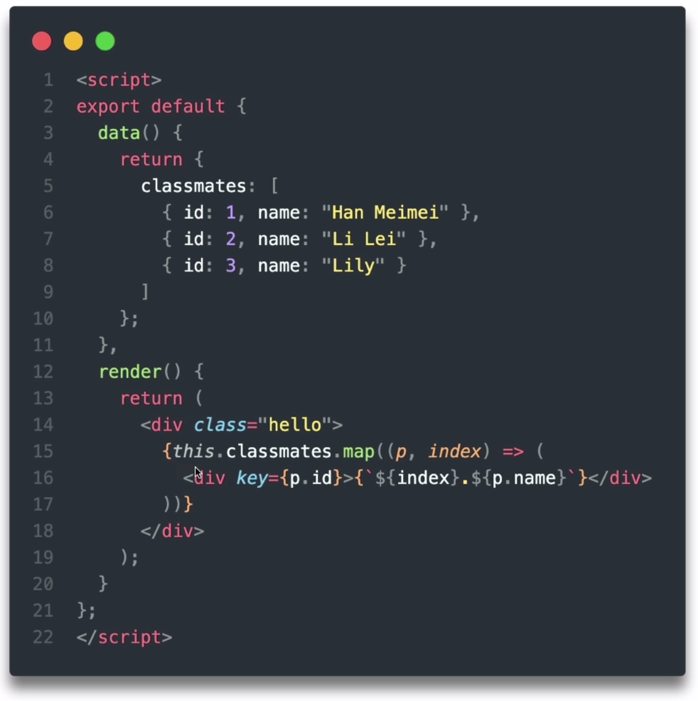

#### 5.数据

##### 5.1 data & prop

> ）data为什么是个函数而不是对象？
>
> 起因：js对象都是通过引用地址关联的，通过直接引用赋值的另一个变量在其修改值时会影响这个引用地址内的数据变化。即修改1处影响多处的可能。
>
> 那么如何杜绝这种影响？
>
> 结果：返回一个生产data的函数，这个组件产生的每一个实例才能维持一份被返回对象的独立拷贝，即函数作用域私有性质
>
> 
>
> ）prop 父传递子
>
> 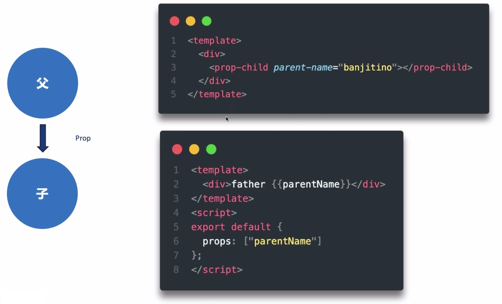
>
> 
>
> ）prop属性校验
>
> 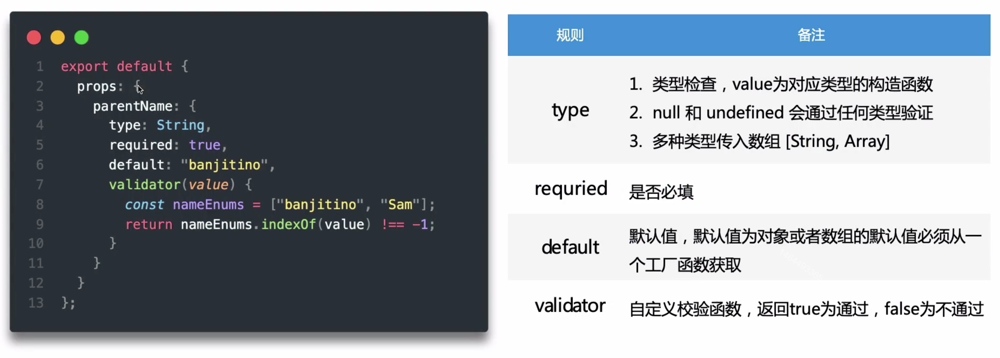

##### 5.2 单向数据流

> 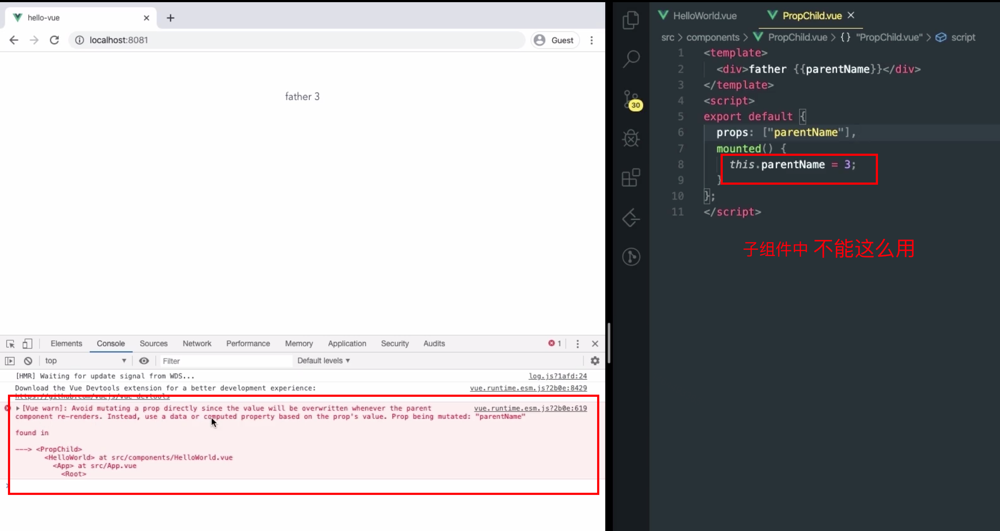
>
> vue是单向数据流的，父组件的数据更新会向下流到子组件，为什么反过来this.parentName则不行？
>
> 原因：在js中数组和对象都是通过引用传递的，对于一个对象或者数组的prop来说，去改变这个prop对象或者数组本身将会影响到父子组件状态，当子组件层级过多或子组件被引用多个地方的话，我们难以知道数据具体是在哪里修改了，会导致应用数据难以理解。
>
> 结果：所以不能这样做是防止子组件意外的去改变父组件的状态。

##### 5.3 计算属性 & 侦听器

> 计算属性和方法的区别

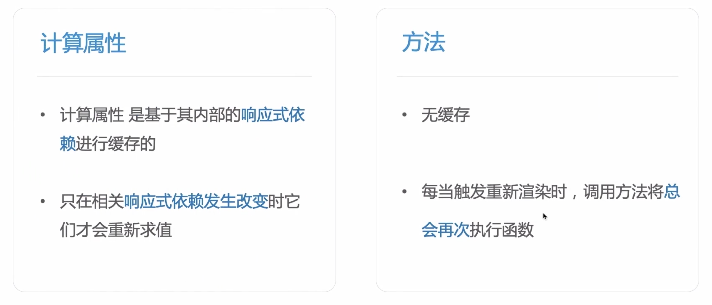

1.方法是在每一次页面渲染的时候，都发生一次运行。比如将count()方法放入到页面当中，当页面渲染时count()方法都会执行一次，而如果将count()放入到computed计算属性当中，当页面发生其它渲染时就不会执行。只有当count依赖的属性发生改变时，才会计算并依赖响应式进行缓存起来。

2.所以相对来说，放在computed里面性能要比方法好。

3.⚠️ 小技巧：在模板中，如果有一些常量不希望被放在dota当中去响应式依赖收集时，可以利用computed的缓存特性，将这个常量放在计算属性当中。

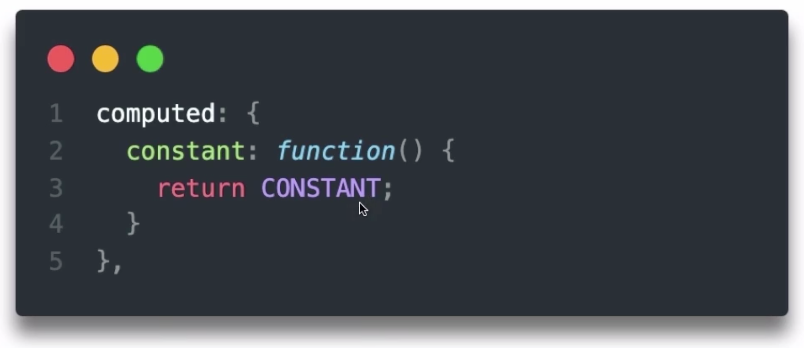

> 侦听器 watch

computed和watch都可以侦听数据的变化，那么他们有什么区别？

1.计算属性是依赖其内部属性相关的响应式依赖发生改变才会重新求值。当数据量较大时，那计算消耗的时间和内存较大，会阻塞我们的渲染。

2.watch一般用在数据变化后执行异步操作或者开销较大的操作

##### 5.4 vue中数组操作

> 这里就不得不提到Object.defineProperty的弊端

- 不能检测对象属性的添加或删除
- 不能检测到数组长度变化（通过改变length而增加的长度不能监测到）
- 其实不是因为defindProperty的局限性，而是vue出于性能的考量，不会对数组每个元素都监听

> Vue为要这么设计呢？

因为数组一般都是用来遍历一些列表的，如果列表是一个海量的数据，在vue的响应式过程中会进行前置的observe依赖收集，那这个收集就会变得很庞大间接的消耗性能

> 解决方案

解决方案一：通过vue.set在data上响应式的添加属性，并把这个属性加到响应式的跟踪里面去。

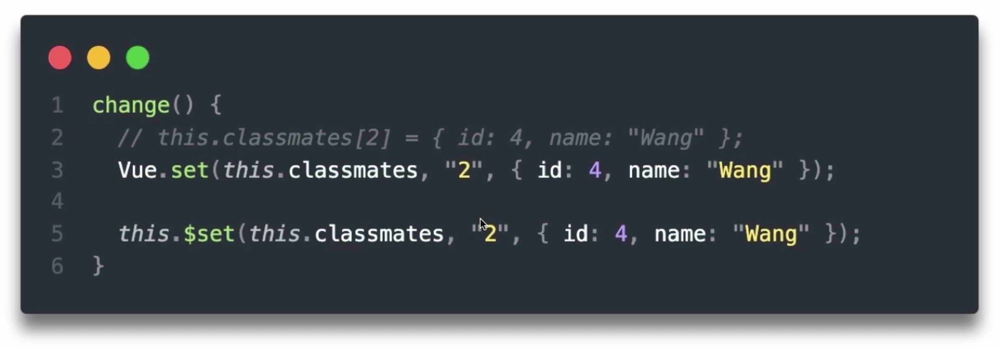

解决方案二：使用数组的push

思考：那为什么数组的push又可以用呢？

那是因为vue对于数组的方法进行了代理包装，把这些数组的函数方法也加入了响应式依赖

```js
const oldArrayProperty = Array.prototype;
const newArrayProperty = Object.create(oldArrayProperty);
['pop', 'push', 'shift', 'unshift', 'splice'].forEach((method) => {
    newArrayProperty[method] = function() {
        renderView();
        oldArrayProperty[method].call(this, ...arguments);
    };
});
 // 在observer函数中加入数组的判断，如果传入的是数组，则改变数组的原型对象为我们修改过后的原型。
    if (Array.isArray(target)) {
        target.__proto__ = newArrayProperty;
    }
```


### 二、高阶用法

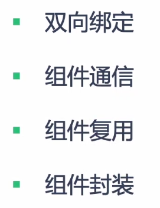

### 三、响应式源码分析

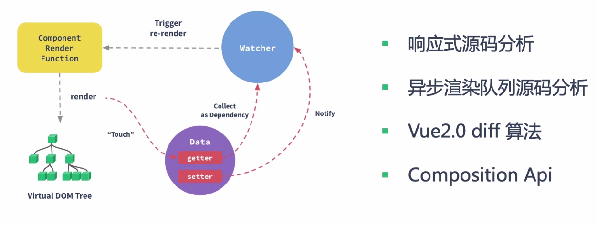

### 四、VUE生态以及源码分析

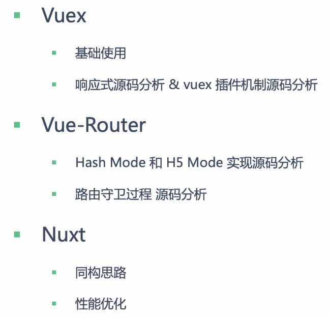

##### test


